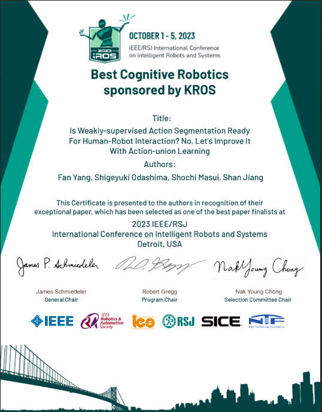
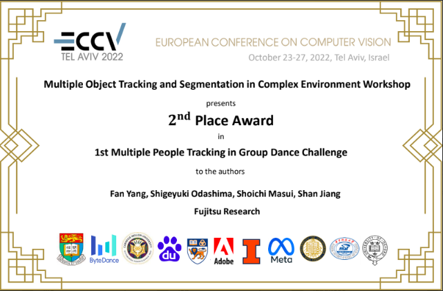
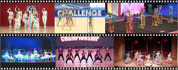
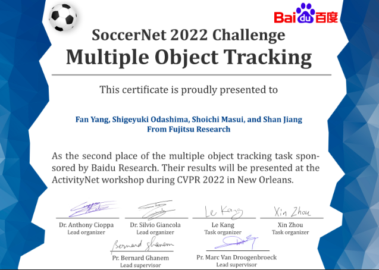
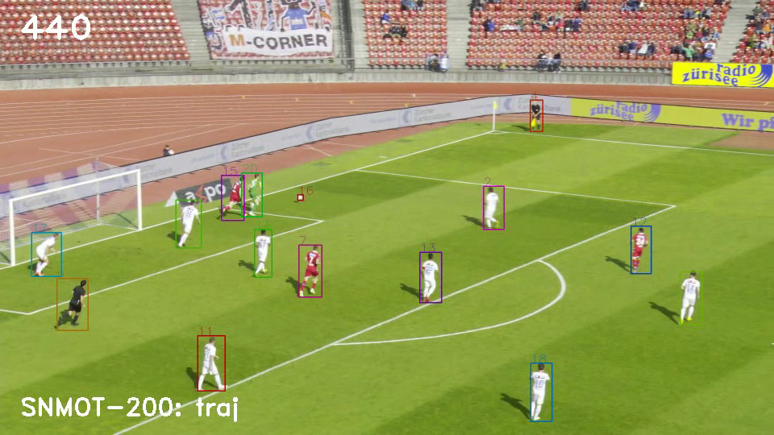
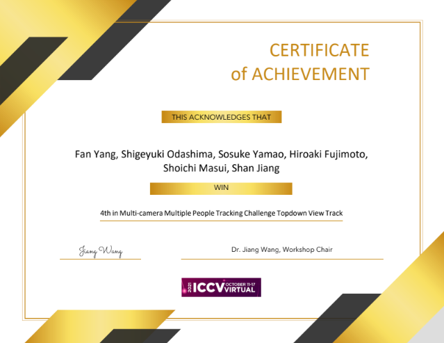
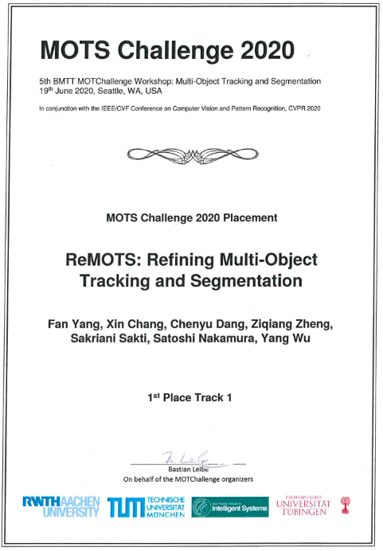
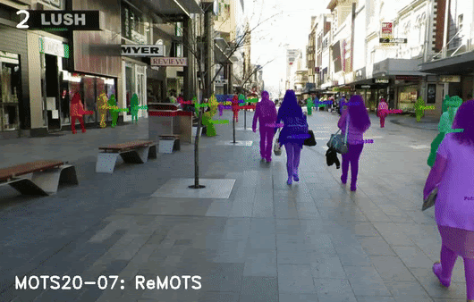
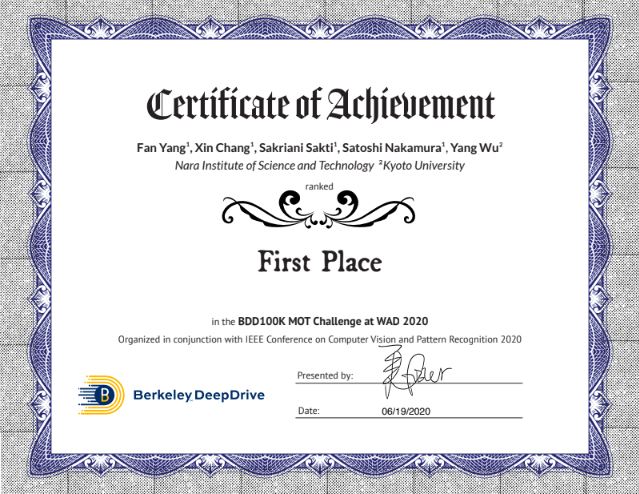
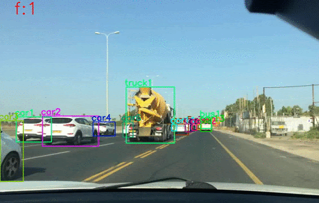

# 🎖 Honors and Awards

## Conference Awards
- *2023* IROS Best Paper Award Finalist on Cognitive Robotics.
- 
## Challenges Awards
- *2022* ECCV Multiple Object Tracking and Segmentation in Complex Environments Workshop Challenges: 🥈2nd-place award on multiple people tracking in group dance task.

  
  

- *2022* CVPR SoccerNet & ActivityNet Workshops Challenges: 🥈2nd-place award on multi-camera multi-person tracking task.

  
  

- *2021* ICCV Multi-camera Multi-person Tracking Workshop Challenges: 🏅4th-place award on multi-camera multi-person tracking task. Click the image to see the report on YouTube.

  
  

- *2020* CVPR MOTS Workshop Challenges: 🥇1st-place award on multi-object tracking and segmentation task.

  
  

- *2020* CVPR Workshop on Autonomous Driving (WAD) Challenges: 🥇1st-place award on BDD100K multi-object tracking task.

  
  

- *2017* ICCV Workshop on 3D Hand Pose Estimation Challenges: 🥇1st-place award on the object interaction task and 🥈2nd-place award on the tracking task. Click the image to see the report on YouTube.

  
  

## Scholarships:
- *2019* NAIST Excellent Student Scholarship.
- *2018-2019* Donghua Education Scholarship.
- *2017* Heiwa Nakajima Scholarship.
