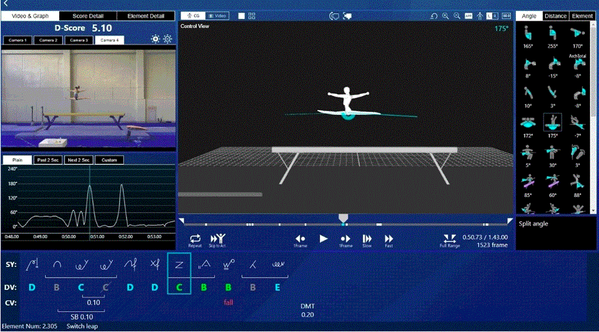

# 📝 Publications 

#### Multi-camera Gymnasst Tracking Module In Fujitsu Gymnastic Judging Support System

Fujitsu Gymnastic Judging Support System

- ``CVM Journal 2023`` [A Unified Multi-view Multi-person Tracking Framework](https://arxiv.org/pdf/2302.03820.pdf), \|**Fan Yang**, Shigeyuki Odashima, Sosuke Yamao, Hiroaki Fujimoto, Shoichi Masui and Shan Jiang 
- ``WACV 2023`` [Hard to Track Objects with Irregular Motions and Similar Appearances? Make It Easier by Buffering the Matching Space](https://arxiv.org/pdf/2211.14317.pdf), \|**Fan Yang**, Shigeyuki Odashima, Shoichi Masui, Shan Jiang
- Our Gymnastic Judging Support System has been successfully applied in 10 apparatuses at [the 52nd FIG Artistic Gymnastics World Championships](https://www.youtube.com/watch?v=CinAYBZYANg). I was responsible for developing the multi-camera gymnast detection and tracking modules for our system. 

My co-author papers and reports are shown on [my Google Scholar](https://scholar.google.co.jp/citations?user=LndV87gAAAAJ). About 12 Patents have not been made online yet.

#### 🎥🤸🤼 Action Recognition
- ``IROS 2023`` [Is Weakly-supervised Action Segmentation Ready For Human-Robot Interaction? No, Let's Improve It With Action-union Learning
](https://www.researchgate.net/profile/Fan-Yang-41/publication/372548891_Is_Weakly-supervised_Action_Segmentation_Ready_For_Human-Robot_Interaction_No_Let's_Improve_It_With_Action-union_Learning/links/64be18dab9ed6874a54076e7/Is-Weakly-supervised-Action-Segmentation-Ready-For-Human-Robot-Interaction-No-Lets-Improve-It-With-Action-union-Learning.pdf) \| **(Best Paper Award Finalists on Cognitive Robotics)**\|**Fan Yang**, Shigeyuki Odashima, Shoichi Masui, Shan Jiang.

- ``arXiv 2022``[Actor-identified Spatiotemporal Action Detection](https://arxiv.org/pdf/2208.12940.pdf) \| **Fan Yang**, Norimichi Ukita, Sakti Sakriani, Nakamura Satoshi [code](https://github.com/fandulu/ASAD/tree/main)
  
- ``ACM MM ASIA 2021`` [Make Skeleton-based Action Recognition Model Smaller, Faster and Better](https://arxiv.org/pdf/1907.09658.pdf) \|**Fan Yang**, Sakti Sakriani, Wu Yang,  Nakamura Satoshi \| [code](https://github.com/fandulu/DD-Net)
  
- ``IEEE ACCESS 2021`` [A framework for knowing who is doing what in aerial surveillance videos](https://ieeexplore.ieee.org/stamp/stamp.jsp?arnumber=8753491) \|**Fan Yang**, Wu Yang, Sakti Sakriani, Nakamura Satoshi

#### 🎥:👣 Tracking

  
- ``Image and Vision Computing 2022`` [Tackling multiple object tracking with complicated motions—re-designing the integration of motion and appearance](https://www.researchgate.net/profile/Fan-Yang-41/publication/361542960_Tackling_multiple_object_tracking_with_complicated_motions_-_Re-designing_the_integration_of_motion_and_appearance/links/62c915c33bbe636e0c4debe0/Tackling-multiple-object-tracking-with-complicated-motions-Re-designing-the-integration-of-motion-and-appearance.pdf) \|**Fan Yang**, Xin Chang, Yang Wu, Sakriani Sakti, Satoshi Nakamura

- ``Image and Vision Computing 2021`` [ReMOT: A model-agnostic refinement for multiple object tracking](https://ahcweb01.naist.jp/papers/journal/2020/2020_IVC_fan-ya_2/202012_IVC_fan-ya.paper.pdf) \|**Fan Yang**, Xin Chang, Yang Wu, Sakriani Sakti, Satoshi Nakamura

- ``ICASSP 2020``[Using panoramic videos for multi-person localization and tracking in a 3D panoramic coordinate](https://arxiv.org/pdf/1911.10535.pdf) \|**Fan Yang**, Feiran Li, Yang Wu, Sakriani Sakti, Satoshi Nakamura\| [code](https://github.com/fandulu/MPLT)
  
- ``IEEE ACCESS 2019`` [A soft proposal segmentation network (SPS-Net) for hand segmentation on depth videos](https://ieeexplore.ieee.org/document/8649643) \|**Fan Yang**, Wu Yang, Sakti Sakriani, Nakamura Satoshi

#### Others
- ``IEEE Transactions on Multimedia 2020``[Instance-level Heterogeneous Domain Adaptation for Limited-labeled Sketch-to-Photo Retrieval](https://github.com/fandulu/IHDA/blob/master/pictures/paper.pdf) \| **Fan Yang**, Wu Yang, Wang Zheng, Li Xiang, Sakti Sakriani, Nakamura Satoshi \| [code](https://github.com/fandulu/IHDA)
  
- ``IEEE EMBC 2018``[Application of SsVGMM to medical data-classification with novelty detection](https://github.com/fandulu/SsVGMM/blob/master/Application_of_SsVGMM_to_Medical_Data___Classification_with_Novelty_Detection.pdf)\| **Fan Yang**, Soriano Jaymar, Kubo Takatomi, Ikeda Kazushi \| [code](https://github.com/fandulu/IHDA)
  
- ``ICONIP 2017``[A hierarchical mixture density network](https://arxiv.org/pdf/1910.13523.pdf)\| **Fan Yang**, Soriano Jaymar, Kubo Takatomi, Ikeda Kazushi 

